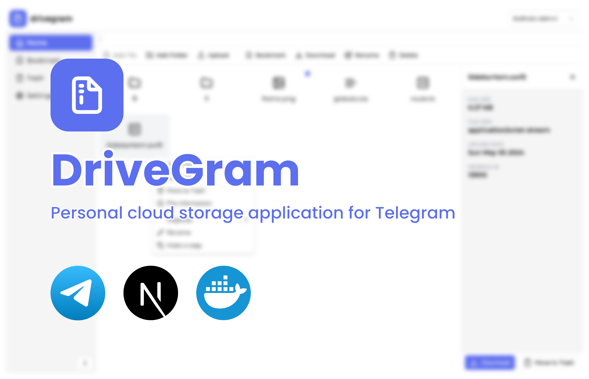

# ☁️ DriveGram - Personal Cloud Storage

DriveGram is a personal cloud storage application that uses Telegram as a drive. It allows you to upload, download, and organize your files using the Telegram API. The project is built using [Next.js](https://nextjs.org) and [Gramjs](https://gram.js.org).

✨ The project is actively under development, expect frequent updates and new features.



Run on your local machine without any external dependencies. You just need to create a Telegram application and get the API ID and API Hash from [my.telegram.org](https://my.telegram.org).

It uses SQLite as a database to store user data and files. You can run the project using Docker or on your local machine.

## Features

- ✨ Clean UI
- 📁 Organize your content
- 📤 Upload/download files
- 🔖 Bookmark files
- 🗑️ Move to trash
- 📱 Multiple accounts

## Roadmap

- [ ] Search files
- [ ] File preview
- [ ] Link Google Drive
- [ ] Generate shareable link
- [ ] Custom chat for uploading files

## 🚀 Installation

Right now, you can run the project locally by following the steps below. It uses SQLite as a database.

### Docker

Use the following commands to run the project using Docker.

```bash
docker run -d -p 3000:3000 \
  -e TELEGRAM_API_ID='' \
  -e TELEGRAM_API_HASH='' whovik/drivegram:latest
```

### Local Server

To run the project locally, follow the steps below.

1. Clone the repository and install the dependencies.

```bash
git clone git@github.com:whovik/drivegram.git
```

2. Install the dependencies and start the server.

```bash
cd drivegram
pnpm install
```

3. Create a `.env` (or copy `.env.example`) file in the root directory and add the following environment variables.

```env
TELEGRAM_API_ID=
TELEGRAM_API_HASH=
```

4. Build and start the server.

```bash
pnpm run build
pnpm drizzle-kit push:sqlite
pnpm start
```

### 🙂 Thanks

Contact me on [Telegram](https://t.me/whovik) for any queries or suggestions.
